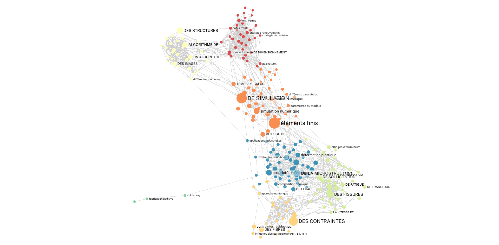

# Cortext

[Cortext](https://www.cortext.net/) est une plateforme web collaborative de text mining orientée sur l'analyse et d'exploitation scientométrique de corpus textuels, développée et maintenue par l'INRAE.


Documentation CortextManager : [https://docs.cortext.net/](https://docs.cortext.net/)

Tutoriel de prise en main : [https://docs.cortext.net/wp-content/uploads/CommentUtiliserCortext.pdf](https://docs.cortext.net/wp-content/uploads/CommentUtiliserCortext.pdf)


<figure><figcaption></figcaption></figure>

### Sources de données spécifiques acceptées (parseurs dédiés)


Documentation : [https://docs.cortext.net/data-formats/](https://docs.cortext.net/data-formats/)


* Fichier zippé&#x20;
* Export WoS
* Export Scopus
* Pubmed
* Istex
* Factiva
* Europresse

### Fonctionnalités principales :

* Extraction de termes (Topic extraction, NER…)
* Analyse de réseaux (cooccurrence, co-citation…)
* Cartographie thématique (analyses factoriales, clustering)
* Chronogrammes (évolution temporelle de concepts)

