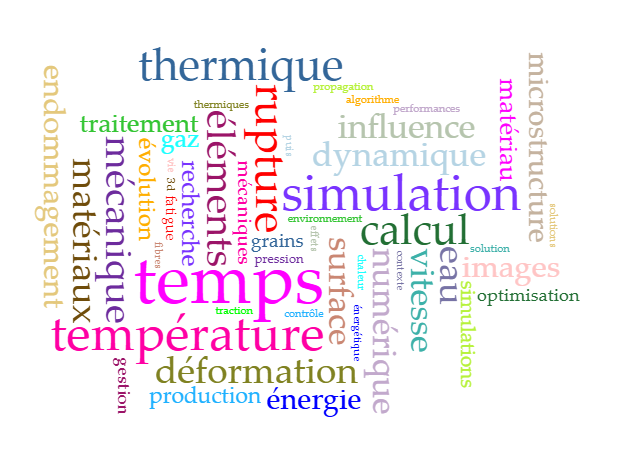

# Voyant Tool

Voyant Tool est une plateforme **web open-source** **no-code d’analyse de textes** : sa simplicité d'accès et son interface interactive conviviale en font un outil très populaire en humanités numériques.

<figure><figcaption></figcaption></figure>

### Fonctionnalités principales :

* Nuages de mots (WordClouds)
* Fréquences de termes
* Concordances (KWIC – keyword in context)
* Analyse de cooccurrences
* Courbes de fréquence dans le temps
* Visualisations (graphes, tendances, relations entre mots)

### Limites

* Pas de traitement avancé du langage (pas de BERT, pas de contextualisation).
* Orienté vers l’exploration quantitative simple de texte.
* Moins adapté aux très gros corpus.
