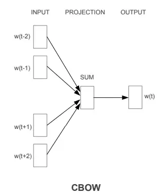
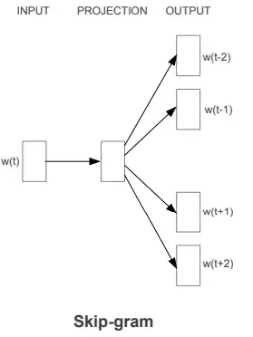

# Techniques et méthodes

L’intelligence artificielle appliquée au langage, ou **Traitement Automatique du Langage Naturel (TAL ou NLP)**, a pour objectif de permettre aux machines de **comprendre, interpréter, et générer du langage humain**.&#x20;

Mais pour qu'un algorithme puisse traiter du texte, <mark style="color:red;">**il faut d’abord convertir les chaînes de caractères qui le composent en nombres**</mark>. Et cette étape est loin d’être triviale, car le langage est riche, ambigu et contextuel.

L'évolution des techniques de NLP (d'encodage de texte) reflète une progression vers une meilleure compréhension du langage par la machine, depuis des représentations brutes du texte pour arriver aujourd'hui à des représentations sémantiques avec des modèles d'embeddings.

## Exemples d'application

<table data-view="cards"><thead><tr><th></th><th data-type="content-ref"></th><th data-hidden data-card-cover data-type="files"></th></tr></thead><tbody><tr><td>Classification de publications</td><td></td><td></td></tr><tr><td>Moteur de recommandations</td><td></td><td><a href="../../.gitbook/assets/screenshot.png">screenshot.png</a></td></tr><tr><td>Moteur de recherche augmentée</td><td><a href="https://huggingface.co/spaces/Geraldine/HAL-UNIV-COTEDAZUR_semantic_search">https://huggingface.co/spaces/Geraldine/HAL-UNIV-COTEDAZUR_semantic_search</a></td><td></td></tr><tr><td>Data visualisation</td><td></td><td><a href="../../.gitbook/assets/titres_tsne.png">titres_tsne.png</a></td></tr></tbody></table>

## La tokenisation

Avant de transformer un texte en nombre pour l'analyser, on doit tout d'abord le <mark style="color:red;">**découper**</mark> <mark style="color:red;">**en unités de base appelées tokens**</mark> afin de le convertir en un ensemble d'unités exploitable.

`La bibliothèque et ses usages évoluent`  -> `["la", "bibliothèque", "et", "ses", "usages", "évoluent"]`

## **Technique Bag of Words (BoW) - Encodage One-hot**


Notebook : [https://colab.research.google.com/drive/1QxtY4VJCI6vxQwWBltPd68dvGlLI2vYg?usp=drive\_link](https://colab.research.google.com/drive/1QxtY4VJCI6vxQwWBltPd68dvGlLI2vYg?usp=drive_link)


Chaque mot "signifiant" est décompté comme une entité isolée -> le texte est considéré comme un simple "sac de mots" dont on comptabilise les occurences (qui peuvent être pondérées).&#x20;

Le BoW est toujours intéressant car facile à implémenter, facile à interpréter et suffisant pour des tâches simples basées sur de la similarité (classification, recommandations...)

### **Principe :**

* Le texte est représenté par la fréquence (ou simple présence) des mots dans un dictionnaire.
* Pas de prise en compte des "mots vides",  de la grammaire, de l’ordre des mots, ou du contexte.
* On obtient une **matrice creuse (sparse)** : chaque document est un vecteur de longueur (dimension) égale au nombre de mots du vocabulaire.
* Variante TF-IDF (Term Frequency – Inverse Document Frequency) : la pondération des mots est améliorée en fonction de leur importance dans le corpus afin de valoriser les mots plus discriminants.

### **Inconvénients :**

* Le principe de la représentation en matrices creuses (beaucoup de 0) n'est pas adaptée en termes de calculs à des vocabulaire très grand.
* Pas de notion de similarité entre mots (ex. "livre" et "ouvrage" sont perçus comme totalement différents). A contrario, des documents contenant les mêmes mots auront des représentations similaires, même s’ils ne parlent pas de la même chose
* Pas de prise en compte du contexte

### Récapitulatif

* Les mots vides sont éliminés
* la place et l'ordre des mots ne sont pas pris en compte
* des groupes de mots sont encodés
* Pas adapté aux gros corpus
* <mark style="color:red;">**Pas de modèle pré-entraînés**</mark>

## Words Embeddings avec word2vec


Notebook : [https://colab.research.google.com/drive/1g7qyhO4aRC7QUkE4GGajWa9zuoyue95M?usp=drive\_link](https://colab.research.google.com/drive/1g7qyhO4aRC7QUkE4GGajWa9zuoyue95M?usp=drive_link)



Article sur Arxiv (2013) : [https://arxiv.org/abs/1301.3781](https://arxiv.org/abs/1301.3781)


> Si nous lisons un mot dans un livre en isolation à travers un masque opaque (…) il est impossible de déterminer sa signification (…) Si maintenant, nous élargissons le masque opaque, de telle manière que nous ne voyons pas seulement le mot, mais aussi un nombre N de mots de chaque côté, si N est suffisamment large, nous pouvons sans ambiguïté trouver la signification du mot&#x20;
>
> WARREN WEAVER, “[MÉMORANDUM](https://aclanthology.org/1952.earlymt-1.1.pdf)“, P. 8

L'algorithme word2vec (2013) représente une rupture dans les techniques de NLP utilisées jusqu'ici en s'appuyant sur un réseau de neurones et en introduisant la prise en compte dans l'encodage de la <mark style="color:red;">**notion de contexte pour capturer la**</mark> <mark style="color:red;">**proximité sémantique**</mark> entre les mots.

### **Principe :**

* **Apprentissage supervisé avec un réseau de neurones simple à une couche**
* Chaque token du corpus est encodé en one-hot selon sa position dans le vocabulaire du corpus, puis le modèle entraîne un réseau de neurone composé de 2 calques (=le modèle ajuste itérativement  2 matrices d'embeddings grâce la minimisation d'une fonction de perte) sur toutes les co-occurrences de mots possibles pour prédire le contexte ou le mot cible.
* Au final le modèle produit est une matrice d'embeddings composé de chaque mot représenté par un vecteur de dimension fixe (ex. 100 ou 300). **La matrice d’embedding est une compression des informations de co-occurrences**. Les vecteurs des mots proches selon leur co-occurrence  (ex docteur et patient, bibliothèque et livre...) vont pointer dans la même direction.
*   Deux architectures principales :

    * CBOW (Continuous Bag of Words) : prédit un mot à partir de son contexte.

    

_Source :_ [_https://drlee.io/you-cant-understand-chatgpt-if-you-don-t-understand-word2vec-step-by-step-code-with-intuitions-dd47ebb596e4_](https://drlee.io/you-cant-understand-chatgpt-if-you-don-t-understand-word2vec-step-by-step-code-with-intuitions-dd47ebb596e4)

* Skip-gram : prédit le contexte à partir d’un mot.

_Source :_ [_https://drlee.io/you-cant-understand-chatgpt-if-you-don-t-understand-word2vec-step-by-step-code-with-intuitions-dd47ebb596e4_](https://drlee.io/you-cant-understand-chatgpt-if-you-don-t-understand-word2vec-step-by-step-code-with-intuitions-dd47ebb596e4)

### Variantes

* Doc2vec : embeddings de paragraphes
* GloVe (Global Vectors for Word Representation) : basé sur la co-occurrence des mots.
* FastText : prend en compte les sous-mots

### **Inconvénients :**

* Ne capture pas bien la polysémie (ex. "banque" = finance vs rivière).

### Récapitulatif

* Les mots vides sont éliminés
* Représentation statique : les embeddings représentant les mots sont fixes (un mot = un vecteur, quel que soit le contexte)
* La notion de sémantique (de sens des mots) est basée sur le contexte (les co-occurrences de mots)
* <mark style="color:red;">**S'applique sur des corpus locaux mais premiers modèles pré-entraînés fournis**</mark> (voir [https://projector.tensorflow.org/](https://projector.tensorflow.org/))

## **BERT : Contextual Embeddings**


Notebook : [https://colab.research.google.com/drive/1xI1W21lx1hX6puvYO5gZMi22cniWxhK0?usp=drive\_link](https://colab.research.google.com/drive/1xI1W21lx1hX6puvYO5gZMi22cniWxhK0?usp=drive_link)



* Article sur Arxiv (2018) : [https://arxiv.org/abs/1810.04805](https://arxiv.org/abs/1810.04805)
* <mark style="color:red;">**Article fondateur de l'architecture Transformer (2017) :**</mark> [<mark style="color:red;">**https://arxiv.org/abs/1706.03762**</mark>](https://arxiv.org/abs/1706.03762)


L’algorithme BERT marque une avancée majeure dans les techniques de NLP en intégrant une lecture **bidirectionnelle du contexte** dans les représentations vectorielles des mots. Contrairement à Word2Vec, BERT ne génère pas une représentation unique d’un mot, mais adapte son embedding selon le contexte de la phrase entière.

### Principes

* BERT s’appuie sur un réseau de neurones d'un type particulier (les **Transformers** présentés dans "Attention is All You Need"), plus précisément sur la **partie encodeur** du Transformer.
*   Le modèle est **pré-entraîné** sur deux tâches :

    * **Masked Language Modeling (MLM)** : certains mots sont masqués dans une phrase, le modèle apprend à les prédire à partir du contexte **des deux côtés**.

    &#x20;      _Exemple : "Le chat est \[MASK] sur le canapé."_ → BERT devine "assis"

    * **Next Sentence Prediction (NSP)** : le modèle apprend à prédire si une phrase suit logiquement une autre.

### Fonctionnement

* **Tokenisation** : chaque phrase est découpée en sous-unités (tokens), souvent via la méthode WordPiece.
* **Encodage** : les tokens sont convertis en vecteurs enrichis par :
  * leur position dans la phrase
  * le segment auquel ils appartiennent (phrase 1 ou 2)
* **Propagation** : les tokens traversent une pile d’encodeurs Transformers, chaque couche appliquant un mécanisme d'auto-attention pour modéliser les relations internes entre mots.

### Tâches réalisables avec Bert

* Extraction d'entités nommées
* Complétion de mots
* Q/A
* Analyse de sentiments
* Calcul de similarité entre phrases

### Variantes

De mutiples variantes et sous-variantes ont été entraînées par la communauté

* DistilBERT (distilbert-base-uncased...) : version allégée et plus rapide
* allenai/scibert-scivocab-uncased : spécialisé pour la littérature scientifique
* microsoft/BiomedNLP-PubMedBERT-base-uncased-abstract : spécialisé bio-médical
* CamemBERT : entraîné sur des corpus français

### Récapitulatif

* Représentation contextuelle dynamique
* Apprentissage par prédiction de mots masqués
* Basé sur l’attention et les transformers
* Polysémie prise en compte
* <mark style="color:red;">**Pré-entraînement généralisé**</mark>  (avec fine-tuning sur des tâches plus spécifiques)
* Représente une rupture dans le NLP profond, en particulier pour les tâches de compréhension du langage naturel

## Comparatif synthétique :

| Méthode       | Type de vecteur | Sémantique ? | Contexte ? | Dimension | Facilité d’usage |
| ------------- | --------------- | ------------ | ---------- | --------- | ---------------- |
| Bag of Words  | Sparse          | ❌            | ❌          | élevée    | ✅✅✅              |
| TF-IDF        | Sparse          | ⚠️ partiel   | ❌          | élevée    | ✅✅               |
| Word2Vec      | Dense           | ✅            | ❌          | moyenne   | ✅✅               |
| FastText      | Dense           | ✅ + morpho   | ❌          | moyenne   | ✅✅               |
| BERT (et GPT) | Dense           | ✅✅✅          | ✅✅✅        | moyenne   | ⚠️ plus complexe |

Dans le contexte des bibliothèques, cela peut concerner :

* L’analyse de titres ou de résumés pour mieux classer ou recommander des documents.
* L’extraction automatique d’informations à partir de notices ou de descriptions.
* La recherche intelligente dans les catalogues.
* L’interaction en langage naturel avec les usagers (chatbots, assistants virtuels...).
