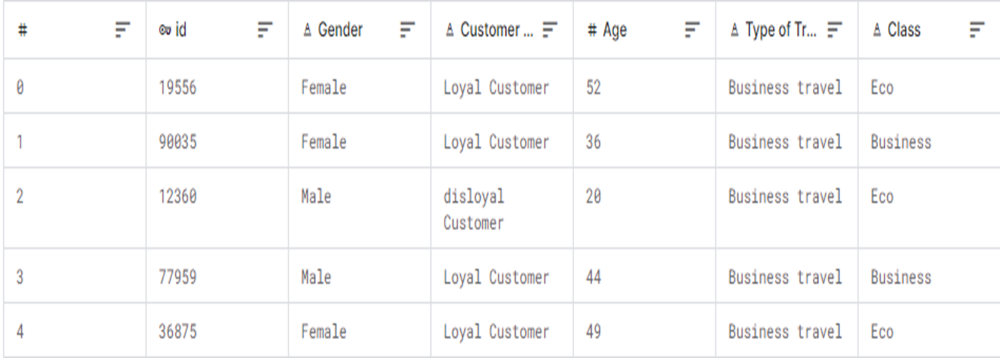

# De la donnée brute à la donnée exploitable


**Notebook :** [**https://colab.research.google.com/drive/1Y4qcJ\_rzr3BXlC-vOI6yNe0qV8\_UWeCl?usp=drive\_link**](https://colab.research.google.com/drive/1Y4qcJ_rzr3BXlC-vOI6yNe0qV8_UWeCl?usp=drive_link)


Les algorithmes de ML sont applicables sur des données structurées (tabulaires) quantitatives, qualitatives et textuelles (grâce aux techniques d’encodage issues du NLP).

Le ML est utilisé sur des datasets afin de

* Faire de la régression : prévoir une variable numérique
* Faire de la classification (binaire ou multiple)
* Faire de la clusterisation

80% du travail de développement d’un système de ML consiste alors



**Comprendre les données : explorer et visualiser les données**

Visualisation des distributions et corrélations, détection des erreurs, détermination des variables non pertinentes...



**Séparer les données en dataset d'entraînement et dataset de test**

On explore tout le dataset pour comprendre les données, mais avant toute phase de préparation technique des données pour le modèle, on doit isoler le dataset de test pour ne plus jamais y toucher avant l’évaluation finale.



**Préparer les données du dataset d'entraînement**

* Nettoyage de "premier niveau" : gestion des valeurs manquantes, gestion des valeurs extrèmes (outliers)
* Equilibrage du dataset : <mark style="color:red;">les données d'entraînement ne doivent pas être biaisées (une modalité sur-représentée par rapport aux autres) car un modèle qui s'entraîne en s'ajustant sur des données deséquilibrées reproduira ces biais de représentations dans ses prédictions.</mark>
* Encodage des variables qualitatives : <mark style="color:red;">les modèles de Machine Learning (sauf arbres) ne peuvent pas utiliser directement des chaînes de caractères -> il faut donc c</mark><mark style="color:red;">**onvertir toutes les valeurs en nombres**</mark>
* Normalisation des variables qualitatives : les variables numériques doivent être mises à la même échelle pour éviter qu'une variable avec de grandes valeurs (ex: revenu en euros) ne domine une variable avec de petites valeurs (ex: âge). Les techniques principales incluent la standardisation (centrage-réduction pour obtenir une moyenne de 0 et un écart-type de 1) et la normalisation Min-Max (pour ramener les valeurs dans un intervalle \[0,1]). Cette étape est particulièrement importante pour les algorithmes géométriques sensibles aux distances.

| Données d'origine                                                                                       | Données processées                                                                                          |
| ------------------------------------------------------------------------------------------------------- | ----------------------------------------------------------------------------------------------------------- |
| 
<figure><figcaption></figcaption></figure>
 | 
<figure><figcaption></figcaption></figure>
 |



Une fois le dataset d'entraînement prêt, il s'agit :&#x20;



**D’entraîner et évaluer plusieurs algorithmes pertinents selon le type de prédictions à réaliser**

L'algorithme est ajusté sur les données d'entraînement puis appliqué aux données de test : l'évaluation consiste à mesurer l'écart entre les valeurs prédites et les valeurs réelles du dataset de test

* Régression : MAE, RMSE
* Classification : accuracy, précision, recall, F1-score



**Choisir l’algorithme le plus performant**

On sélectionne le modèle qui obtient les meilleures performances sur les métriques d'évaluation choisies, tout en tenant compte de la complexité du modèle, du temps d'entraînement et d'inférence. Il faut éviter le surapprentissage (overfitting) en vérifiant que les performances sur le jeu de test restent cohérentes avec celles du jeu d'entraînement



**Tuner les paramètres et hyper-paramètres du modèle afin de l’optimiser**

On ajuste les hyper-paramètres (learning rate, profondeur d'arbres, nombre de voisins, régularisation, etc.) en utilisant des techniques comme la recherche par grille (Grid Search), la recherche aléatoire (Random Search) ou l'optimisation bayésienne sur un jeu de données de validation.



**Déploiement du modèle en production**

* Mise en place de l'infra nécessaire (serveurs, conteneurs, pipelines de données)&#x20;
* Accès au modèle par API ou service accessible aux applications métier.&#x20;
* Documentation des inputs/outputs attendus.&#x20;
* Tests d'intégration pour vérifier le bon fonctionnement dans les conditions réelles d'utilisation.



**Monitorer le système**

* Surveillance en continu des performances du modèle en production : temps de réponse, taux d'erreur, distribution des prédictions.
* Détection de la dérive des données (data drift) ou du modèle (model drift) qui indique que les caractéristiques des nouvelles données diffèrent de celles d'entraînement.&#x20;
* Mise en place d'alertes automatiques en cas de dégradation des performances.



**Mettre à jour le système**

* Ré-entraînement périodique du modèle avec des données fraîches.
* Évaluation régulière de l'architecture du modèle (un nouvel algorithme plus performant ?)
* Gestion des versions des modèles pour pouvoir revenir à une version antérieure en cas de problème.


