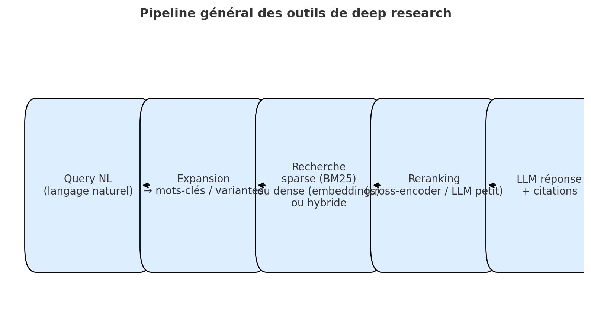

# Cas d'usage


## Notebooks :&#x20;

* **ICL et RAG :** [**https://colab.research.google.com/drive/1l8-zHRYNPTrlBB5-ypvDHixzSimbTgyR?usp=drive\_link**](https://colab.research.google.com/drive/1l8-zHRYNPTrlBB5-ypvDHixzSimbTgyR?usp=drive_link)
* **Démo Deep research :** [**https://drive.google.com/file/d/1TqRISB-kl5zmYl6Uy5xgSq1ni6oamjcp/view?usp=drive\_link**](https://drive.google.com/file/d/1TqRISB-kl5zmYl6Uy5xgSq1ni6oamjcp/view?usp=drive_link)


## Techniques de prompts et In-Contexte Learning

### Prompt système - prompt utilisateur

Dans les modèles conversationnels, on distingue deux types de prompts aux rôles complémentaires :

* Prompt système : on donne le contexte général dans lequel doit s'inscrire le modèle et les consignes qu'il doit suivre. Il définit la "personnalité", le domaine d'expertise, le style de réponse, les limitations à respecter, et le format de sortie attendu. Ce prompt reste généralement constant durant toute la session -> Le prompt système "programme" le comportement du modèle

_Exemples : "Tu es un assistant pédagogique qui explique les concepts complexes avec des analogies simples", "Réponds uniquement en français et formate tes réponses en markdown"_

* Prompt utilisateur : la requête spécifique, la question ou la tâche que l'utilisateur souhaite accomplir. Il varie à chaque interaction et contient les détails concrets de ce qui est demandé -> Le prompt utilisateur déclenche l'action spécifique

### In-Context Learning

L'In-Context Learnin**g** (ICL) désigne la capacité des LLMs à apprendre et s'adapter à de nouvelles tâches **uniquement à partir d'exemples fournis dans le prompt, sans modification des paramètres du modèle**.

* Zero-shot learning : on pose une question ou on donne une instruction à un modèle dans un prompt “de base” sans contexte supplémentaire ni exemple préalable
* One-shot Learning : on fournit dans le prompt un exemple clair et précis de ce que le modèle doit imiter pour générer sa réponse
* Few-shot Learning : par extension du one-shot learning, on ajoute plusieurs exemples directement dans le prompt afin de conditionner explicitement le modèle à suivre le pattern donné dans les exemples

_Voir la section sur les_ [_consignes et exemples de prompt_](prompts-quelques-principes-consignes-et-exemples.md)

### Applications

Synthèse, résumé, extraction de données structurées, classification (non-supervisée)

### LLMs spécialisés (quelques exemples)

Il existe également des modèles de langage spécialisés pré-entraînés qui peuvent s'avérer plus efficaces pour certaines applications spécifiques.

* Extraction d'entités : [Gliner](https://huggingface.co/urchade/gliner_multi-v2.1) (avantage : les entités ne sont pas pré-definies)&#x20;
  * Playground (HuggingFace space) : [https://huggingface.co/spaces/urchade/gliner\_multiv2.1](https://huggingface.co/spaces/urchade/gliner_multiv2.1)
* Extraction de données structurées depuis des données non structurées : NuExtract
  * Playgrouds (HuggingFace spaces) : [https://huggingface.co/spaces/dwb2023/NuExtract-1.5](https://huggingface.co/spaces/dwb2023/NuExtract-1.5), [https://huggingface.co/spaces/numind/NuExtract-2.0](https://huggingface.co/spaces/numind/NuExtract-2.0), [https://huggingface.co/spaces/numind/NuMarkdown-8B-Thinking](https://huggingface.co/spaces/numind/NuMarkdown-8B-Thinking)

## Retrieval augmented generation RAG

Le RAG est un dispositif de requêtage d'un LLM qui a pour but d’augmenter la précision et la pertinence des réponses du modèle en palliant aux limitations “natives” des modèles de langage : domaine de connaissances hors de son corpus d’apprentissage, corpus statique constitué à un instant T, hallucinations... . Pour ce faire, il s'agit de combiner le pouvoir génératif des modèles de langage avec la capacité à récupérer des informations pertinentes issues de sources de données externes, autrement dit d’exploiter les capacités de calculs appliquées au langage naturel des LLMs sur des documents externes choisis par l'utilisateur.

**Le RAG est donc une extension du In-Context Learning et une forme de personnalisation d'un modèle à moindre coût (pas de modification des poids du modèle) qui consiste à intégrer des données externes au corpus d’apprentissage du LLM dans le processus de génération de contenu**

### Etapes d'un dispositif de RAG



### Data Loading

Récupération des données là où elles se trouvent (PDF, docx, page web, base de données, requête API...) -> conversion en format texte simple ou markdown



### Chunk & embedding & Index & sauvegarde

Le corpus additionnel (les données contextuelles de l’utilisateur) est tout d’abord découpé en une suite de séquences de mots, chacune de ces séquences est ensuite convertie en vecteurs sémantiques avec un modèle d’embeddings, puis le tout est enfin stocké dans un index ou une base de données vectorielle (un vector store)

<figure><figcaption></figcaption></figure>



### Query & retriever

Le prompt de l’utilisateur, transformé en embedings avec le même modèle que l’étape 2, n’est pas envoyé directement au LLM mais d’abord vers le vector store afin d’y opérer des calculs de similarité sur les vecteurs du contexte et d'en extraire les segments les plus proches (considérés comme les plus pertinents, en accord avec le principe selon lequel des concepts similaires ont des embeddings similaires )



### Génération de contenu

Au final, la prompt initial de l’utilisateur et les segments du contexte retenus en tant que donnnées sémantiques les plus pertinentes sont plugés dans un même système d’instructions qui est alors envoyé au LLM, de manière à ce que le contenu généré (ie les calculs de distance réalisés dans l’espace vectoriel du LLM) prenne en compte les informations contextuelles complémentaires préalablement sélectionnées.

<figure><figcaption></figcaption></figure>



## Outils de Deep Research


Démo : [https://huggingface.co/spaces/Geraldine/Deep-research-demo](https://huggingface.co/spaces/Geraldine/Deep-research-demo)


Ressource : blog & articles d'Aaron Tay&#x20;

* Outils de recherche académique : [https://musingsaboutlibrarianship.blogspot.com/2025/03/testing-ai-academic-search-engines-1.html](https://musingsaboutlibrarianship.blogspot.com/2025/03/testing-ai-academic-search-engines-1.html)
* Etude domparative Primo research Assistant/WoS research Assistant/Scopus AI : [https://katinamagazine.org/content/article/reviews/2025/deep-dive-into-three-ai-academic-search-tools](https://katinamagazine.org/content/article/reviews/2025/deep-dive-into-three-ai-academic-search-tools)

***

#### Synthèse de l'étude comparative

<figure><figcaption></figcaption></figure>

| Méthode / Fonction          | Primo Research Assistant                    | Scopus AI                                    | Web of Science Research Assistant       |
| --------------------------- | ------------------------------------------- | -------------------------------------------- | --------------------------------------- |
| **Type de RAG**             | Standard RAG                                | RAG Fusion (multi-requête + fusion)          | Standard RAG                            |
| **Query Expansion**         | Génère 10 variantes de mots-clés            | Génère plusieurs requêtes enrichies          | Utilise des blocs de synonymes          |
| **Type de recherche**       | Recherche par mots-clés + reranking         | Hybride : mots-clés + vectorielle            | Recherche par mots-clés uniquement      |
| **Vector Search**           | Oui, pour reranker les résultats            | Oui, via embeddings + fusion                 | Non                                     |
| **Hybrid Search**           | Non                                         | Oui (copilot choisit la méthode)             | Non                                     |
| **Reranking des résultats** | Oui, top 30 rerankés par embeddings         | Oui, via Reciprocal Rank Fusion              | Non, classement par algorithme standard |
| **Interprétabilité**        | Moyenne (requête visible, reranking opaque) | Faible (composant vectoriel peu transparent) | Élevée (requête et classement visibles) |
| **Reproductibilité**        | Moyenne (\~1/5 variation)                   | Très faible (\~1/2 variation)                | Moyenne (\~1/5 variation)               |
| **Langage naturel accepté** | Oui                                         | Oui                                          | Oui                                     |
| **Langue de réponse**       | Langue d’entrée                             | Toujours en anglais                          | Langue d’entrée                         |

***

**En résumé** :

* **Primo** privilégie la simplicité avec un bon équilibre entre expansion de requête et reranking vectoriel.
* **Scopus AI** est le plus sophistiqué techniquement, mais le moins transparent.
* **Web of Science RA** est le plus interprétable, mais moins performant en récupération complexe.

