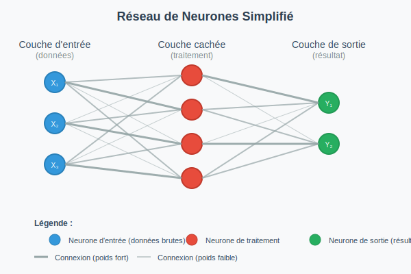

# Quelques rappels


**Notebook :** [**https://colab.research.google.com/drive/12N1FPdFOE4EUA2\_qSksGn8sxYYQJDLZ8?usp=drive\_link**](https://colab.research.google.com/drive/12N1FPdFOE4EUA2_qSksGn8sxYYQJDLZ8?usp=drive_link)


Le NLP consiste à appliquer des méthodes statistiques via des algorithmes de Machine Learning (apprentissage machine) ou de Deep Learning (apprentissage profond) à du langage naturel afin de comprendre et interpréter le language naturel.

Pour pouvoir développer des modèles d'apprentissage sur du texte, le pré-requis consiste à convertir des unités linguistiques en objets mathématiques manipulables pour des calculs et des représentations graphiques.

## Rappel sur la notion de vecteurs

Définition : segment de droite orienté (flèche), ayant pour extrémités un point de départ et un point d'arrivée, et formant un objet mathématique sur lequel on peut effectuer des opérations. Seul compte la longueur, la direction et le sens d'un vecteur (pas ses coordonnées absolues).

| Race           | Taille | Intelligence |
| -------------- | ------ | ------------ |
| Dogue allemand | 5      | 5            |
| Border Collie  | 3      | 5            |
| Caniche        | 1      | 1            |
| Beagle         | 2      | 3            |
| Bulldog        | 3      | 2            |

| Repésentation en points                                         | Représentation en vecteurs                                      |
| --------------------------------------------------------------- | --------------------------------------------------------------- |
|  |  |

## Rappel sur la tokenisation

Définition : découpage d'un texte en tokens (unités de base) qui n'ont de valeur intrinsèque ou de signification exploitable que dans leur environnement.

| Texte                                                                                    | Tokens                                                                                                                                |
| ---------------------------------------------------------------------------------------- | ------------------------------------------------------------------------------------------------------------------------------------- |
| Peintre officiel de la marine et fondateur de la société coloniale des artistes français | \['peintre', 'officiel', 'de', 'la', 'marine', 'et', 'fondateur', 'de', 'la', 'société', 'coloniale', 'des', 'artistes', 'français,'] |
| Peintre officiel de la marine et fondateur de la société coloniale des artistes français | \['peintr', 'officiel', 'marin', 'fondateur', 'societ', 'colonial', 'artist', 'franc']                                                |

## Réseaux de neurones

Un réseau de neurones est un système informatique inspiré du fonctionnement du cerveau humain, conçu pour reconnaître des motifs et apprendre à partir d'exemples.&#x20;

Le réseau est formé de petites unités de calcul (les "neurones artificiels") interconnectées qui se transmettent des signaux numériques. Chaque neurone reçoit des informations, les traite selon des règles mathématiques simples, puis transmet le résultat aux neurones suivants.&#x20;

Les connexions entre ces neurones créent un "lien" affecté d'un "poids" qui détermine l'importance du signal transmis. Pendant l'apprentissage, le réseau ajuste automatiquement ces poids en analysant de nombreux exemples - par instance, si on lui montre des milliers d'images de chats étiquetées "chat", il apprendra progressivement à identifier les caractéristiques qui définissent un chat.&#x20;

<figure><figcaption></figcaption></figure>

## Vectorisation basique : Vecteurs issus de matrices creuses (one-hot encoding et Bag-of-Words)


* Encodage one-hot NLP "historique"
* Texte -> Tokens -> one-hot vecteurs


<table><thead><tr><th>Texte</th><th valign="top">Tokens</th></tr></thead><tbody><tr><td>Peintre officiel de la marine et fondateur de la société coloniale des artistes français, Louis Jules Dumoulin (1860-1924) a parcouru le monde. Entre 1888, date de son premier voyage au long cours et 1897, il effectue deux missions officielles en Asie qui le conduiront à séjourner à trois reprises au Japon mais aussi dans plusieurs autres pays dont la Chine et surtout l’Indochine française, territoire qui fera de ce patriote un colonialiste convaincu et militant. Artiste prolifique et jouissant d’une influence certaine de son vivant, Dumoulin a livré de nombreux tableaux inspirés de ces voyages et exécutés à partir d’études in situ ou de modèles photographiques puisées dans sa riche collection personnelle. Malgré le fait qu’il soit l’un des premiers peintres français à avoir effectué le voyage jusqu’au Japon et en dépit de la grande quantité d’œuvres inspirées par ce pays dans sa production, il reste dans le peu de notoriété que lui accorde l’histoire de l’art exclusivement un peintre colonial. Fruit de recherches fondamentales au sujet d’un personnage très peu étudié, le présent mémoire s’appuie sur des documents d’époque mais aussi sur des sources primaires inédites dont la collection photographique de plus d’un millier de clichés acquis ou pris par Dumoulin et annotés de sa main, afin d’interroger le rôle qu'a joué l’Extrême-Orient et plus particulièrement le Japon dans la vie et l'œuvre de cet artiste et sa place dans le japonisme de la fin du XIXe siècle. Elle vise également, selon une approche imagologique et comparatiste avec des témoignages écrits et picturaux d’artistes, d’intellectuels et d’écrivains contemporains de Dumoulin, à analyser dans l’œuvre et les écrits de ce dernier les représentations du Japon, de son peuple et de son évolution politique et sociale ainsi que la réception de sa production en France et au Japon.</td><td valign="top">['1860', '1888', '1897', '1924', 'accord', 'acquis', 'afin', 'ains', 'analys', 'annot', 'approch', 'appui', 'art', 'artist', 'asi', 'auss', 'autr', 'avoir', 'certain', 'cet', 'chin', 'clich', 'collect', 'colonial', 'comparat', 'conduiront', 'contemporain', 'convaincu', 'cour', 'dat', 'dep', 'derni', 'deux', 'docu', 'dont', 'dumoulin', 'effectu', 'entre', 'exclus', 'extrêm', 'exécut', 'fait', 'fer', 'fin', 'fondamental', 'fondateur', 'franc', 'français', 'fruit', 'grand', 'histoir', 'imagolog', 'in', 'indochin', 'influenc', 'inspir', 'intellectuel', 'interrog', 'inédit', 'japon', 'jou', 'jul', 'jusqu', 'livr', 'long', 'lou', 'main', 'malgr', 'marin', 'milit', 'milli', 'mission', 'model', 'mond', 'mémoir', 'nombreux', 'notoriet', 'officiel', 'orient', 'parcouru', 'part', 'particuli', 'patriot', 'pay', 'peintr', 'personnag', 'personnel', 'peu', 'peupl', 'photograph', 'pictural', 'plac', 'plus', 'plusieur', 'polit', 'premi', 'primair', 'pris', 'product', 'prolif', 'présent', 'puis', 'quantit', 'recherch', 'repris', 'représent', 'rest', 'rich', 'récept', 'rôl', 'selon', 'siecl', 'situ', 'social', 'societ', 'sourc', 'sujet', 'surtout', 'séjourn', 'tableau', 'territoir', 'tres', 'trois', 'témoignag', 'vi', 'vis', 'viv', 'voyag', 'xix', 'écrit', 'écrivain', 'égal', 'époqu', 'étud', 'étudi', 'évolu', 'œuvr']</td></tr></tbody></table>

Vecteur pour "Dumoulin" -> \[0, 0, 0, 0, 0, 0, 0, 0, 0, 0, 0, 0, 0, 0, 0, 0, 0, 0, 0, 0, 0, 0, 0, 0, 0, 0, 0, 0, 0, 0, 0, 0, 0, 0, 0, 1, 0, 0, 0, 0, 0, 0, 0, 0, 0, 0, 0, 0, 0, 0, 0, 0, 0, 0, 0, 0, 0, 0, 0, 0, 0, 0, 0, 0, 0, 0, 0, 0, 0, 0, 0, 0, 0, 0, 0, 0, 0, 0, 0, 0, 0, 0, 0, 0, 0, 0, 0, 0, 0, 0, 0, 0, 0, 0, 0, 0, 0, 0, 0, 0, 0, 0, 0, 0, 0, 0, 0, 0, 0, 0, 0, 0, 0, 0, 0, 0, 0, 0, 0, 0, 0, 0, 0, 0, 0, 0, 0, 0, 0, 0, 0, 0, 0, 0, 0, 0, 0]

Vecteur pour "artiste colonial français" -> \[0, 0, 0, 0, 0, 0, 0, 0, 0, 0, 0, 0, 0, 1, 0, 0, 0, 0, 0, 0, 0, 0, 0, 1, 0, 0, 0, 0, 0, 0, 0, 0, 0, 0, 0, 0, 0, 0, 0, 0, 0, 0, 0, 0, 0, 0, 1, 0, 0, 0, 0, 0, 0, 0, 0, 0, 0, 0, 0, 0, 0, 0, 0, 0, 0, 0, 0, 0, 0, 0, 0, 0, 0, 0, 0, 0, 0, 0, 0, 0, 0, 0, 0, 0, 0, 0, 0, 0, 0, 0, 0, 0, 0, 0, 0, 0, 0, 0, 0, 0, 0, 0, 0, 0, 0, 0, 0, 0, 0, 0, 0, 0, 0, 0, 0, 0, 0, 0, 0, 0, 0, 0, 0, 0, 0, 0, 0, 0, 0, 0, 0, 0, 0, 0, 0, 0, 0]

## Words embeddings avec word2vec


* Algorithme basé sur un réseau de neurone "simple" à 3 couches
* Texte -> Tokens -> one-hot vecteurs
* Premiers modèles pré-entraînés


#### Comment est entrainé le modèle ?

Le modèle crée des words embeddings pour chaque mot à partir de son contexte environnant (occurrences présentes avant et après) dans le but de capturer les relations sémantiques entre les mots. Il fonctionne sur le principe que les mots avec des significations similaires doivent avoir des représentations vectorielles similaires (qui pointent vers les mêmes directions)

| Contexte                        | Target   | Contexte one-hot                       | Target one-hot       |
| ------------------------------- | -------- | -------------------------------------- | -------------------- |
| (officiel, de)                  | peintre  | \[\[0, 0, 0, 1, 0, ...],\[\[1,0,0,...] | \[0,0,0,0,0...1,0,0] |
| (peintre, de, la)               | officiel |                                        |                      |
| (peintre, officiel, la, marine) | de       |                                        |                      |
| (officiel, de, marine, et)      | la       |                                        |                      |
| (de, la, et, fondateur)         | marine   |                                        |                      |
| (la, marine, fondateur, de)     | et       |                                        |                      |

<figure><figcaption></figcaption></figure>

#### Limites

* Mêmes vecteurs pour un mot quel que soit le contexte (pas “contextualisés”)
* Pas de prise en compte de la direction de la phrase et de l'ordre des mots (seulement co-occurrences)

**Premiers modèles pré-entraînés** : on passe du modèle local (non partageable) créé en appliquant un algorithme sur ses données aux modèles "clé en main"  pré-entraînés sur des quantités de données (des vocabulaires) suffisantes pour pouvoir être utilisés dans la plupart des contextes.

Démo : [http://nlp.polytechnique.fr/word2vec](http://nlp.polytechnique.fr/word2vec)

